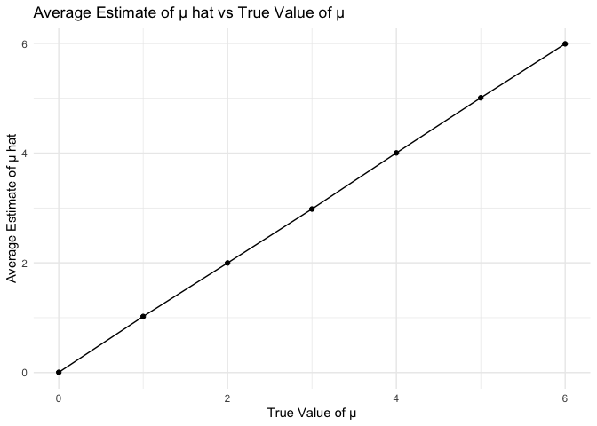
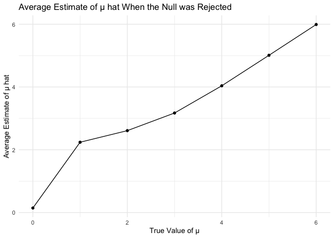
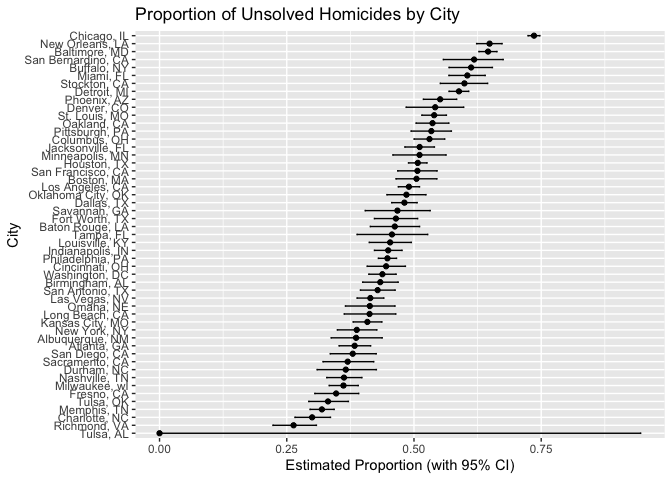

p8105_hw5_ms6826
================
2024-11-09

``` r
library(tidyverse)
```

    ## ── Attaching core tidyverse packages ──────────────────────── tidyverse 2.0.0 ──
    ## ✔ dplyr     1.1.4     ✔ readr     2.1.5
    ## ✔ forcats   1.0.0     ✔ stringr   1.5.1
    ## ✔ ggplot2   3.5.1     ✔ tibble    3.2.1
    ## ✔ lubridate 1.9.3     ✔ tidyr     1.3.1
    ## ✔ purrr     1.0.2     
    ## ── Conflicts ────────────────────────────────────────── tidyverse_conflicts() ──
    ## ✖ dplyr::filter() masks stats::filter()
    ## ✖ dplyr::lag()    masks stats::lag()
    ## ℹ Use the conflicted package (<http://conflicted.r-lib.org/>) to force all conflicts to become errors

``` r
set.seed(1031)
```

## Problem 1

Write a function

``` r
bday_sim= function(n) {
  
  bdays= sample(1:365, size=n, replace = TRUE)

  duplicate= length(unique(bdays))<n
  
  return(duplicate)
  
}
```

Run this function 10000 times, compute probability, and make a plot
showing the probability as a function of group size

``` r
sim_res=
  expand.grid(
    n = 2:50,
    iter= 1:1000
  ) |> 
  mutate(res=map_lgl(n, bday_sim)) |> 
  group_by(n) |> 
  summarize(prob=mean(res))

sim_res |> 
  ggplot(aes(x= n, y = prob)) +
  geom_line()
```

<!-- -->
Comment: As group size increases, the probability of duplicate birthdays
also increases.

## Problem 2

Set the design elements and generate datasets

``` r
sim_power= function(samp_size=30, true_mean=0, true_sd=5, alpha=0.05) {
  sim_df=
    tibble(
      x=rnorm(samp_size, true_mean,true_sd)
    )
  
   out_df=
    sim_df |> 
    summarize(
      mu_hat=mean(x),
      p_value=t.test(x, mu=0) |> broom::tidy() |> 
     pull(p.value)
    ) 
    
    
   return(out_df)
  
}

sim_results_df=
  expand_grid(
    iter= 1:5000
  ) |> 
  mutate(power_df=map(iter, sim_power, samp_size=30, true_mean=0)
         ) |> 
  unnest(power_df)
print(sim_results_df)
```

    ## # A tibble: 5,000 × 3
    ##     iter mu_hat p_value
    ##    <int>  <dbl>   <dbl>
    ##  1     1 -0.134  0.438 
    ##  2     2  0.299  0.410 
    ##  3     3  0.888  0.147 
    ##  4     4 -1.37   0.0930
    ##  5     5  0.572  0.548 
    ##  6     6 -1.14   0.368 
    ##  7     7  1.38   0.371 
    ##  8     8 -2.45   0.173 
    ##  9     9 -0.271  0.876 
    ## 10    10 -2.84   0.0622
    ## # ℹ 4,990 more rows

Repeat the above for 𝜇={1,2,3,4,5,6}

``` r
sim_final=
  expand_grid(
    true_mean=c(0,1,2,3,4,5,6),
    iter=1:5000
  ) |> 
  mutate(samp_res=map(true_mean, sim_power, samp_size=30)) |> 
  unnest(samp_res)
print(sim_final)
```

    ## # A tibble: 35,000 × 4
    ##    true_mean  iter   mu_hat p_value
    ##        <dbl> <int>    <dbl>   <dbl>
    ##  1         0     1 -0.528     0.616
    ##  2         0     2  0.408     0.631
    ##  3         0     3  0.187     0.867
    ##  4         0     4  0.801     0.414
    ##  5         0     5 -0.515     0.602
    ##  6         0     6  1.48      0.118
    ##  7         0     7 -0.591     0.528
    ##  8         0     8  1.18      0.199
    ##  9         0     9 -0.120     0.913
    ## 10         0    10 -0.00675   0.994
    ## # ℹ 34,990 more rows

Make a plot showing power vs true mean

``` r
sim_final |> 
  group_by(true_mean) |> 
  summarize(power=mean(p_value<0.05)) |> 
  ggplot(aes(x=true_mean, y=power)) +
  geom_point() +
  geom_line() +
  labs(
    title = "Power vs. True Value of μ",
    x = "True Value of μ",
    y = "Power"
  ) +
  theme_minimal()
```

<!-- -->
Comment: As effect size increases, the power also increases.

Make a plot for the average estimate of 𝜇̂ on the y axis and the true
value of 𝜇on the x axis.

``` r
sim_final |> 
  group_by(true_mean) |> 
  summarize(avg_mu_hat=mean(mu_hat), .groups = 'drop') |> 
  ggplot(aes(x=true_mean, y=avg_mu_hat))+
  geom_point() +
  geom_line() +
  labs(
    title = "Average Estimate of μ hat vs True Value of μ",
    x = "True Value of μ",
    y = "Average Estimate of μ hat"
  ) +
  theme_minimal()
```

<!-- -->

Make a second plot only in samples for which the null was rejected

``` r
sim_final |> 
  filter(p_value<0.05) |> 
  group_by(true_mean) |> 
  summarize(avg_mu_hat_rejected=mean(mu_hat), .groups = 'drop') |> 
  ggplot(aes(x=true_mean, y=avg_mu_hat_rejected))+
  geom_point() +
  geom_line() +
  labs(
    title = "Average Estimate of μ hat When the Null was Rejected",
    x = "True Value of μ",
    y = "Average Estimate of μ hat"
  ) +
  theme_minimal()
```

<!-- -->
–Yes, the sample average of mu hat across tests for which the null is
rejected is approximately equal to the true value of mu (especially for
larger values of mu), and this is expected because a sample where the
statistical test is rejected means that the estimated mu was
significantly different (with the significance level=0.05) from zero.

## Problem 3

Describe the raw data: The raw data for each homicide includes an ID#
that lists the first three letters of the city the homicide took place
as well as its \# on this list of 52,169 homicides.The raw data also
includes the reported date of the homicide, the location of the homicide
(city, state, lat, long), demographic information on the victim (e.g.,
first name, last name, race, age, etc.), as well as the disposition.

Create a city_state variable and summarize within cities to obtain the
total number of homicides and the number of unsolved homicides.

``` r
homicide_df=
  read_csv("data/homicide-data.csv") 
```

    ## Rows: 52179 Columns: 12
    ## ── Column specification ────────────────────────────────────────────────────────
    ## Delimiter: ","
    ## chr (9): uid, victim_last, victim_first, victim_race, victim_age, victim_sex...
    ## dbl (3): reported_date, lat, lon
    ## 
    ## ℹ Use `spec()` to retrieve the full column specification for this data.
    ## ℹ Specify the column types or set `show_col_types = FALSE` to quiet this message.

``` r
hom_df=
homicide_df |> 
  mutate(city_state=paste(city, state, sep=", ")) |> 
  group_by(city_state) |> 
  summarize(
    tot_homicides=n(),
    unsolved_homicides = sum(disposition %in% c("Closed without arrest", "Open/No arrest"))
  )
```

For the city of Baltimore, MD, use the prop.test function and pull the
estimated proportion and confidence intervals from the resulting tidy
dataframe

``` r
balt_df=
  prop.test(
    x=hom_df |> filter(city_state=="Baltimore, MD") |> pull(unsolved_homicides), 
    n=hom_df |> filter(city_state=="Baltimore, MD") |> pull(tot_homicides)) |> 
  broom::tidy()

balt_df |> 
  knitr::kable() 
```

|  estimate | statistic | p.value | parameter |  conf.low | conf.high | method                                               | alternative |
|----------:|----------:|--------:|----------:|----------:|----------:|:-----------------------------------------------------|:------------|
| 0.6455607 |   239.011 |       0 |         1 | 0.6275625 | 0.6631599 | 1-sample proportions test with continuity correction | two.sided   |

``` r
balt_df |> 
  pull(estimate) 
```

    ##         p 
    ## 0.6455607

``` r
balt_df |> 
  pull(conf.low)
```

    ## [1] 0.6275625

``` r
balt_df |> 
  pull(conf.high)
```

    ## [1] 0.6631599

Run prop.test for each of the cities in your dataset and create a tidy
dataframe with estimated proportions and CIs for each city.

``` r
results_df=
  hom_df |> 
  mutate(
    prop_table=map2(unsolved_homicides, tot_homicides, ~prop.test(x=.x, n=.y)),
    tidy=map(prop_table, broom::tidy)) |> 
  select(-prop_table) |> 
  unnest(cols = c(tidy)) |> 
  select(city_state, estimate, conf.low, conf.high) 
```

    ## Warning: There was 1 warning in `mutate()`.
    ## ℹ In argument: `prop_table = map2(unsolved_homicides, tot_homicides,
    ##   ~prop.test(x = .x, n = .y))`.
    ## Caused by warning in `prop.test()`:
    ## ! Chi-squared approximation may be incorrect

``` r
print(results_df)
```

    ## # A tibble: 51 × 4
    ##    city_state      estimate conf.low conf.high
    ##    <chr>              <dbl>    <dbl>     <dbl>
    ##  1 Albuquerque, NM    0.386    0.337     0.438
    ##  2 Atlanta, GA        0.383    0.353     0.415
    ##  3 Baltimore, MD      0.646    0.628     0.663
    ##  4 Baton Rouge, LA    0.462    0.414     0.511
    ##  5 Birmingham, AL     0.434    0.399     0.469
    ##  6 Boston, MA         0.505    0.465     0.545
    ##  7 Buffalo, NY        0.612    0.569     0.654
    ##  8 Charlotte, NC      0.300    0.266     0.336
    ##  9 Chicago, IL        0.736    0.724     0.747
    ## 10 Cincinnati, OH     0.445    0.408     0.483
    ## # ℹ 41 more rows

Create a plot that shows the estimates and CIs for each city

``` r
results_df |> 
  arrange(estimate) |> 
  mutate(city_state = factor(city_state, levels = city_state)) |> 
  ggplot(aes(x=city_state, y=estimate))+
  geom_point()+
  geom_errorbar(aes(ymin = conf.low, ymax = conf.high), width = 0.2)+
  coord_flip()+
    labs(
    title = "Proportion of Unsolved Homicides by City",
    x = "City",
    y = "Estimated Proportion (with 95% CI)"
  )
```

<!-- -->
