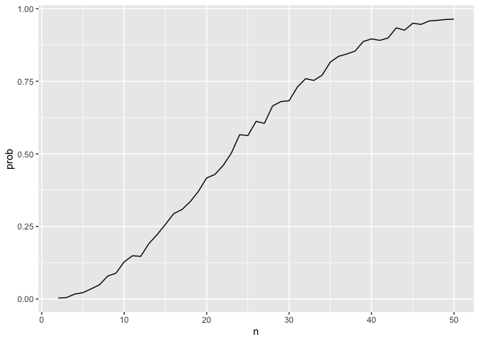

p8105_hw5_ms6826
================
2024-11-09

``` r
library(tidyverse)
```

    ## ── Attaching core tidyverse packages ──────────────────────── tidyverse 2.0.0 ──
    ## ✔ dplyr     1.1.4     ✔ readr     2.1.5
    ## ✔ forcats   1.0.0     ✔ stringr   1.5.1
    ## ✔ ggplot2   3.5.1     ✔ tibble    3.2.1
    ## ✔ lubridate 1.9.3     ✔ tidyr     1.3.1
    ## ✔ purrr     1.0.2     
    ## ── Conflicts ────────────────────────────────────────── tidyverse_conflicts() ──
    ## ✖ dplyr::filter() masks stats::filter()
    ## ✖ dplyr::lag()    masks stats::lag()
    ## ℹ Use the conflicted package (<http://conflicted.r-lib.org/>) to force all conflicts to become errors

## Problem 1

Suppose you put 𝑛people in a room, and want to know the probability that
at least two people share a birthday. For simplicity, we’ll assume there
are no leap years (i.e. there are only 365 days) and that birthdays are
uniformly distributed over the year (which is actually not the case).
Write a function that, for a fixed group size, randomly draws
“birthdays” for each person; checks whether there are duplicate
birthdays in the group; and returns TRUE or FALSE based on the result.

``` r
bday_sim= function(n) {
  
  bdays= sample(1:365, size=n, replace = TRUE)

  duplicate= length(unique(bdays))<n
  
  return(duplicate)
  
}
```

Next, run this function 10000 times for each group size between 2 and
50. For each group size, compute the probability that at least two
people in the group will share a birthday by averaging across the 10000
simulation runs. Make a plot showing the probability as a function of
group size, and comment on your results.

``` r
sim_res=
  expand.grid(
    n = 2:50,
    iter= 1:1000
  ) |> 
  mutate(res=map_lgl(n, bday_sim)) |> 
  group_by(n) |> 
  summarize(prob=mean(res))

sim_res |> 
  ggplot(aes(x= n, y = prob)) +
  geom_line()
```

<!-- --> As
group size increases, the probability of duplicate birthdays also
increases.
